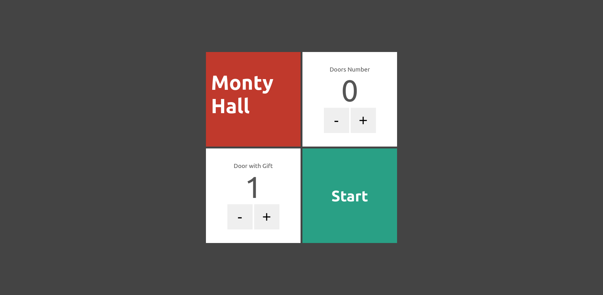

 
 

  

<h2 align="center">Monty Hall with Next.js</h2>
  

    This repository is a study of Next.js, based on a course, which the link is bellow.
     
     
    <a href="https://youtube.com/playlist?list=PL9aKtVrF05DyEwK5kdvzrYXFdpZfj1dsG"><strong>Watch the course »</strong></a>
     
     
    <a href="https://br.linkedin.com/in/matheus-alvarenga-de-oliveira">My LinkedIn Profile</a>
    ·
    <a href="https://github.com/matheusAlvarenga">My Github Profile</a>

